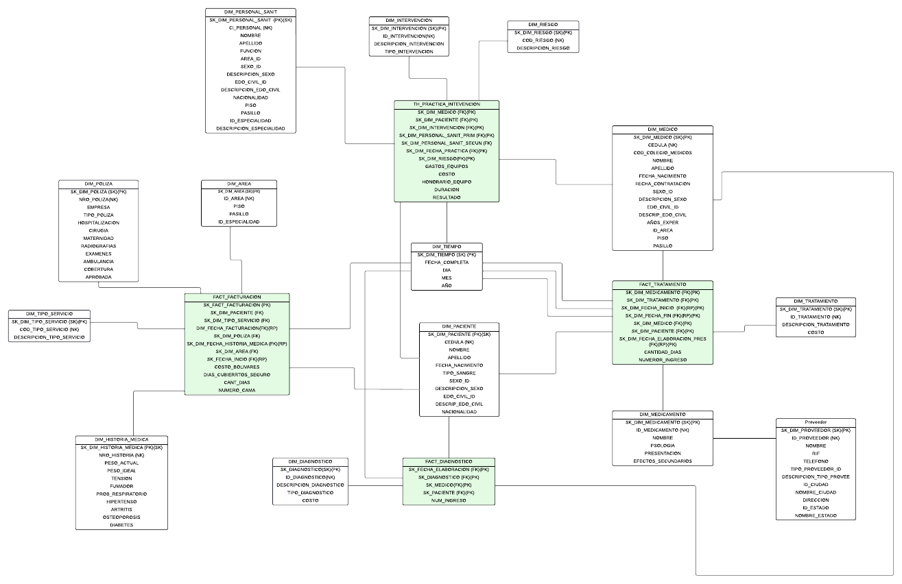

  

# Proyecto-BI-UCAB

Se llevó a cabo el diseño de un modelo dimensional para la modelación de los procesos de tratamiento, intervención, diagnóstico y facturación en el Hospital SanaSalud. Se utilizaron herramientas como Power BI y Pentaho para la creación de los procesos ETL (Extracción, Transformación y Carga), y PostgreSQL sirvió como el contenedor de datos transaccionales y dimensionales. Este enfoque permitió mejorar la gestión de información y facilitar el análisis de datos para la toma de decisiones en la atención al paciente.

## Modelo Dimensional

https://lucid.app/lucidchart/d02100ba-74c9-4ac8-b323-a9210afbc642/edit?viewport_loc=-394%2C-426%2C7703%2C3951%2CdJpF1fIdzVE-&invitationId=inv_9fa14f0f-0d95-4f34-8fd3-2c66d0385d97

## Herramientas usadas

**Power BI**

  

**Pentaho**

  

**PostgreSQL: v16**

  

## Authors

- ### [@Alex Altuve](https://github.com/Alex-Altuve)  
- ### [@Eduardo Izaguirre](https://github.com/EduIza27)  
- ### [@Santiago Peña](https://github.com/Handleinchain)  
